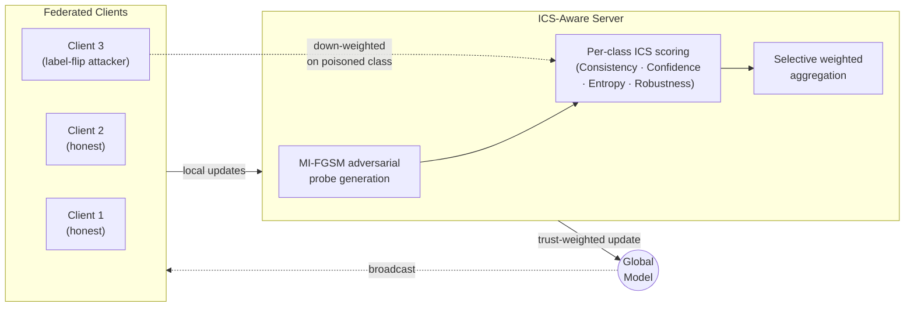
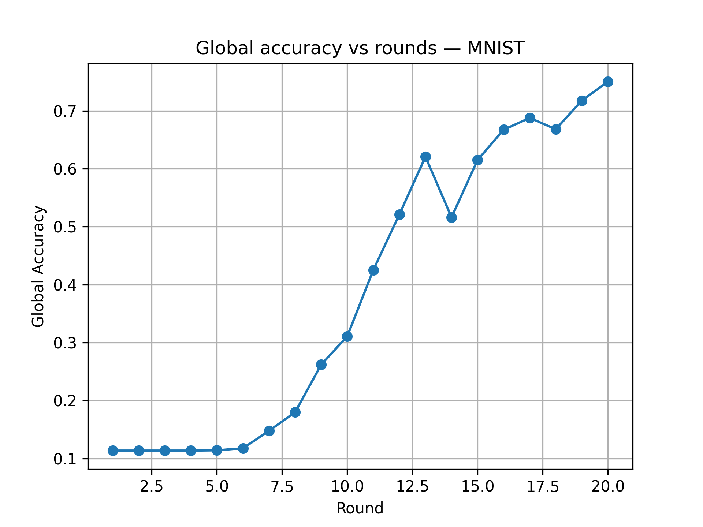
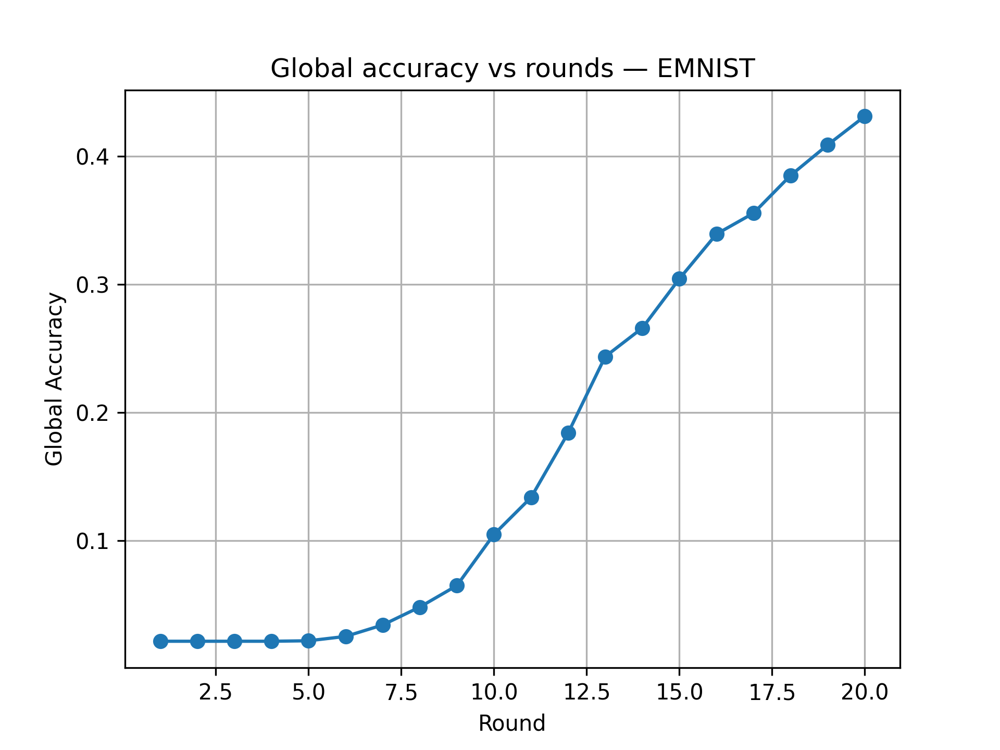
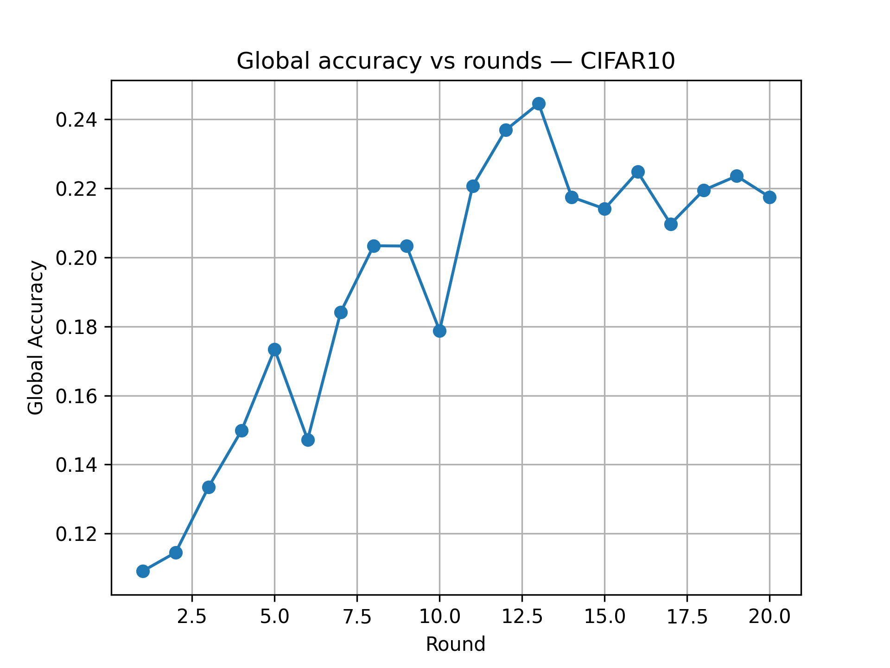
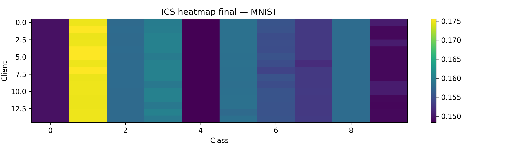
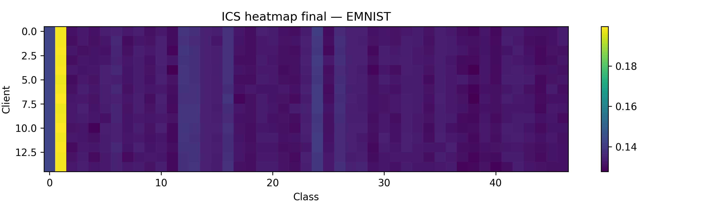
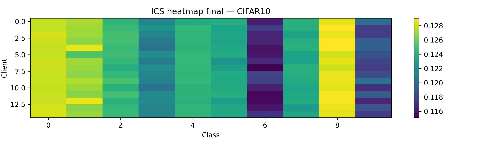
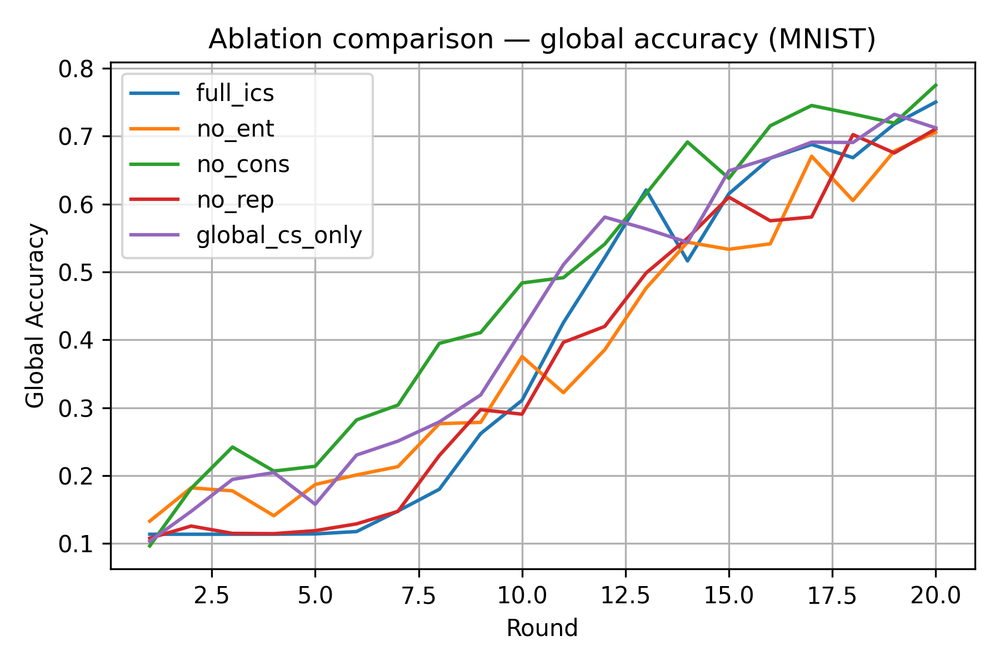
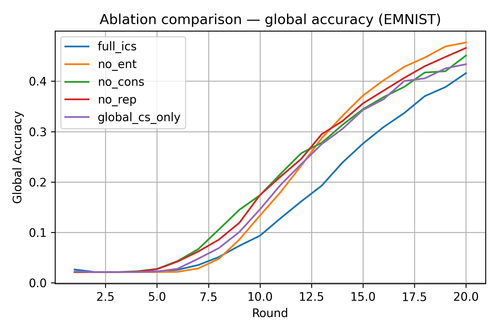
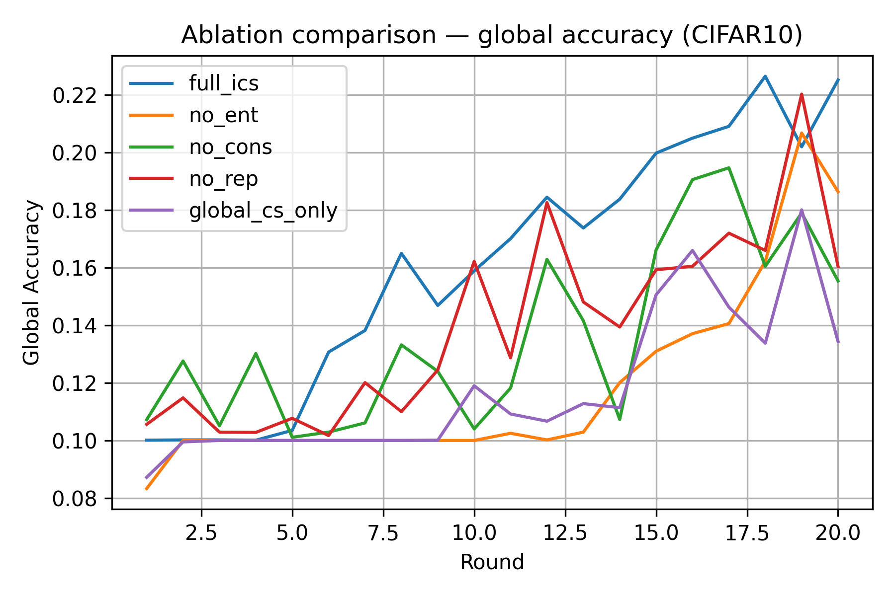

<div align="center">

# 🛡️ ICS: Independent Class-wise Coherence Score
### Detecting Adversarial Data Poisoning in Federated Learning

[](https://www.python.org/)
[](https://pytorch.org/)
[](LICENSE)
[]()

*Generative AI course project — Spring 2026, FAST-NUCES · Supervisor: Dr. Nouman Noor*

</div>

---

## 🧠 The Problem

Federated Learning lets many clients train one shared model without ever handing over their raw
data — great for privacy, terrible for trust. A malicious client can quietly **flip labels** or
**plant a backdoor** in its local data, and the server has no direct way to see it happening.

Existing defenses score each client's trustworthiness using one **global** agreement number.
That's too coarse — an attacker can poison just *one* class and hide comfortably inside a good
global average.

## 💡 The Idea: ICS

**Independent Class-wise Coherence Score (ICS)** stops judging clients as a whole and instead
asks, *per class*: "does this client behave the way an honest client would, specifically on
this class?" It does this by probing every client with **adversarially generated MI-FGSM
samples** and combining four signals into one weighted trust score:

| Signal | What it measures |
|---|---|
| **Output Consistency** | Does the client agree with the crowd on clean inputs? |
| **Class Confidence** | Is the client confidently correct, or vaguely right? |
| **Inverse Entropy** | How decisive vs. wishy-washy are the client's predictions? |
| **Prediction Consistency** | Does the client hold up under adversarial perturbation? |

Clients that fail *any* class-specific check get down-weighted in that round's aggregation —
instead of being judged (and forgiven) on a single global score.



## 📊 Results (15 clients · 20 rounds · targeted label-flip attack)

Final-round accuracy and Attack Success Rate (ASR — lower is better) with full ICS enabled:

| Dataset | Accuracy | Attack Success Rate |
|---|:---:|:---:|
| **MNIST**   | 75.0% | 19.8% |
| **EMNIST**  | 43.1% | 36.1% |
| **CIFAR-10**| 21.8% | 61.4% |

<table>
<tr>
<td width="33%"><b>MNIST</b><br/></td>
<td width="33%"><b>EMNIST</b><br/></td>
<td width="33%"><b>CIFAR-10</b><br/></td>
</tr>
</table>

### Per-class trust: honest clients vs. the attacker

The heatmap below is exactly why ICS exists — a global score would average this away, but
per-class scoring exposes precisely *which* class the attacker corrupted.

<table>
<tr>
<td width="33%"></td>
<td width="33%"></td>
<td width="33%"></td>
</tr>
</table>

## 🔬 Ablation: does every ICS component actually earn its place?

Each variant below removes one signal from the full ICS score. Full ICS wins the
accuracy/ASR trade-off on EMNIST and CIFAR-10, confirming no component is dead weight:

<table>
<tr>
<td width="33%"></td>
<td width="33%"></td>
<td width="33%"></td>
</tr>
</table>

| Dataset | Variant | Accuracy | ASR |
|---|---|:---:|:---:|
| MNIST | **Full ICS** | 75.0% | **19.8%** |
| MNIST | no entropy signal | 70.6% | 23.8% |
| MNIST | no consistency signal | 77.5% | 17.3% |
| MNIST | no robustness probe | 71.1% | 24.2% |
| MNIST | global score only | 71.2% | 23.7% |
| CIFAR-10 | **Full ICS** | **22.5%** | **63.9%** |
| CIFAR-10 | global score only | 13.4% | 90.2% |

*(full table in [`results/final_full_run/ablation/ablation_summary.csv`](results/final_full_run/ablation/ablation_summary.csv))*

## 📁 Repo layout

```
├── src/
│   ├── ics_federated_experiment.py   # FL loop, MI-FGSM probes, ICS scoring & aggregation
│   └── run_ablation_grid.py          # sweeps ablation variants across datasets
├── results/                          # convergence curves, ICS heatmaps, ablation logs
│   └── final_full_run/               # 15-client, 20-round, 3-dataset headline run
└── report/                           # IEEE-format LaTeX paper (main.tex) + figures
```

## 🚀 Running it

```bash
pip install -r requirements.txt
python src/ics_federated_experiment.py   # full federated run + ICS scoring
python src/run_ablation_grid.py          # ablation sweep
```

MNIST/EMNIST/CIFAR-10 download automatically via `torchvision` on first run — no dataset
files are checked into this repo.

## 📄 Paper

The full write-up, with related work and the ICS derivation, is in
[`report/main.tex`](report/main.tex) (IEEE conference format).

---

<div align="center">
<sub>Laiba Mazhar · i221855@nu.edu.pk · National University of Computer and Emerging Sciences</sub>
</div>
